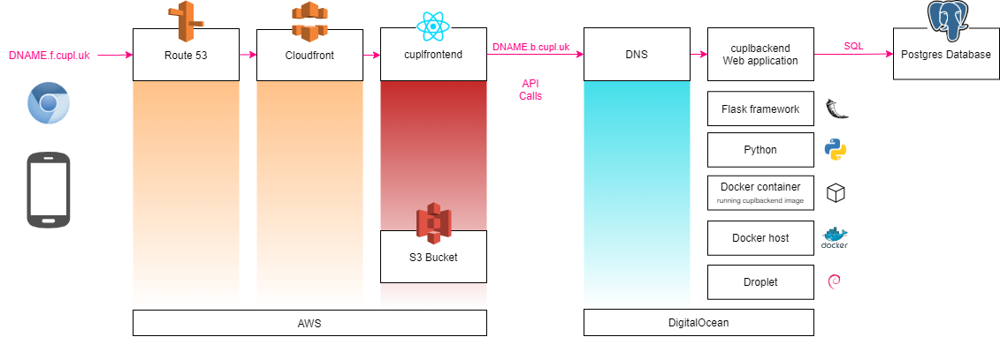

# cupldeploy

A simple way to deploy a system made up of:

* A web application (cuplfrontend and cuplbackend).
* The cuplTag hardware and firmware.

## System Diagram 



DNAME is short for DEPLOYMENT NAME `d3` or `latest`

### Frontend

The frontend web application is hosted at a domain, for example: [latest.f.cupl.uk](https://latest.f.cupl.uk). 

The domain is registered with [Amazon Route53](https://docs.aws.amazon.com/route53/?id=docs_gateway). 

An **A Record** routes traffic to a [Amazon CloudFront distribution](https://docs.aws.amazon.com/AmazonCloudFront/latest/DeveloperGuide/distribution-working-with.html). CloudFront is a [Content Delivery Network](https://en.wikipedia.org/wiki/Content_delivery_network), which stores copies of **files** from a given **origin** at edge locations worldwide. 

* The files are a production optimized build of the **cuplfrontend** [static web application](https://en.wikipedia.org/wiki/Static_web_page). 
* The origin is an [Amazon S3 Bucket](https://aws.amazon.com/s3/), a *pay-for-what-you-use* web folder with near infinite capacity.

CloudFront reduces latency in file access, compared to just hosting from S3. It is also easy to add an Amazon-provided SSL certificate, by [requesting one](https://aws.amazon.com/premiumsupport/knowledge-center/install-ssl-cloudfront/) in Amazon Certificate Manager. The frontend should be served over HTTPS in a production environment. 

The frontend web application provides a Graphical User Interface to **cuplbackend**. Data are stored and retrieved via calls to its web-based API.

### Backend

The backend web application is hosted at a domain name, for example: [latest.b.cupl.uk](https://latest.b.cupl.uk). 

The domain is registered with the DigitalOcean DNS. An **A record** routes traffic to the IP address of a DigitalOcean Droplet, which is a virtual machine running Linux. 

Services are packaged into [Docker](https://en.wikipedia.org/wiki/Docker_(software)) containers. This is done for isolation: one service is not able to interfere with another. Each *sees* its own Linux installation and has to install its own dependencies, thereby avoiding [dependency hell](https://en.wikipedia.org/wiki/Dependency_hell). 

The 3 services run on a single Docker instance using [Docker Compose](https://docs.docker.com/compose/).  Each is defined in [docker-compose.yml](docker-compose.yml):

1. [Nginx-certbot](https://hub.docker.com/r/staticfloat/nginx-certbot/) runs the web server, **Nginx**. This acts as a *reverse proxy*. It rewrites requests received over TCP/IP into the [WSGI](https://en.wikipedia.org/wiki/Web_Server_Gateway_Interface) protocol, which is standard for Python web applications.
2. [cuplbackend](https://hub.docker.com/r/cupl/backend) is the Python web application. It is built atop of the [Flask](https://flask.palletsprojects.com/en/1.1.x/) framework. The application exposes [two HTTPS APIs](https://cupl.readthedocs.io/projects/backend/en/latest/docs/api/index.html). The interface is text only: data are read and written as [JSON](https://en.wikipedia.org/wiki/JSON). Data are persisted in an external PostgreSQL database.
3. A [Redis](https://hub.docker.com/_/redis) instance. A cuplbackend dependency named [Flask-Limiter](https://flask-limiter.readthedocs.io/en/stable/) uses this to record and block API requests. 

# Clone the repository

`git clone --recursive https://github.com/cuplsensor/cuplbackend`

# Set environment variables

```
chmod +x autogenpwd.sh
export ADMINAPI_CLIENTSECRET=$(./autogenpwd.sh)
export TAGTOKEN_CLIENTSECRET=$(./autogenpwd.sh)
export DB_PASS=$(./autogenpwd.sh)
export HASHIDS_SALT=$(./autogenpwd.sh)
export CSRF_SESSION_KEY=$(./autogenpwd.sh)
export SECRET_KEY=$(./autogenpwd.sh)
docker-compose config
```

# Create a droplet
Follow instructions https://danielwachtel.com/devops/deploying-multiple-dockerized-apps-digitalocean-docker-compose-contexts

## Add a domain name to the droplet
Set the Github secret CUPL_DEPLOY_LATEST_HOST to this name.

## Log in as root via SSH
```ssh root@$CUPL_DEPLOY_LATEST_HOST```

## Add a non-root user
e.g. deployer. Set the Github secret CUPL_DEPLOY_LATEST_USER to this name.

## Create an SSH key pair for the non-root user
There should be no pass phrase. Copy the entire contents of the private key into a Github secret named CUPL_DEPLOY_LATEST_KEY. 

Copy the public key to the droplet with: 

```ssh-copy-id -i ~/.ssh/deployerkey $CUPL_DEPLOY_LATEST_USER@$CUPL_DEPLOY_LATEST_HOST```


