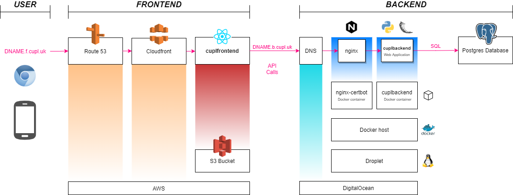
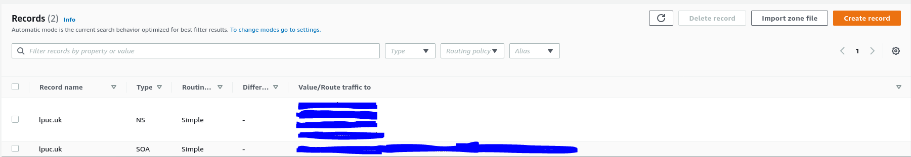

# cupldeploy

Deploys a system made up of:

* A web application comprised of [cuplfrontend](https://github.com/cuplsensor/cuplfrontend) and [cuplbackend](https://github.com/cuplsensor/cuplbackend).
* [cuplTag](https://github.com/cuplsensor/cupltag) hardware and firmware.

## System Diagram 



DNAME is short for DEPLOYMENT NAME `d3` or `latest`

### Frontend Diagram

Scanning cuplTag with an NFC phone causes the frontend web application to open. 

The application is hosted at a domain, for example: [latest.f.cupl.uk](https://latest.f.cupl.uk) and registered to the [Amazon Route53](https://docs.aws.amazon.com/route53/?id=docs_gateway) DNS server. 

An **A Record** routes traffic to a [Amazon CloudFront distribution](https://docs.aws.amazon.com/AmazonCloudFront/latest/DeveloperGuide/distribution-working-with.html). CloudFront is a [Content Delivery Network](https://en.wikipedia.org/wiki/Content_delivery_network), which stores copies of **files** from a given **origin** at edge locations worldwide. 

* The files are a production optimized build of the **cuplfrontend** [static web application](https://en.wikipedia.org/wiki/Static_web_page). 
* The origin is an [Amazon S3 Bucket](https://aws.amazon.com/s3/), a *pay-for-what-you-use* web folder with near infinite capacity.

CloudFront reduces latency in file access, compared to just hosting from S3. It is also easy to add an Amazon-provided SSL certificate, by [requesting one](https://aws.amazon.com/premiumsupport/knowledge-center/install-ssl-cloudfront/) in Amazon Certificate Manager. The frontend should be served over HTTPS in a production environment. 

The frontend web application provides a Graphical User Interface to **cuplbackend**. Data are stored and retrieved via calls to its web-based API.

### Backend Diagram

The backend web application is hosted at a domain name, for example: [latest.b.cupl.uk](https://latest.b.cupl.uk). 

The domain is registered with the DigitalOcean DNS server. An **A record** routes traffic to the IP address of a DigitalOcean Droplet, which is a virtual machine running Linux. 

Services are packaged into [Docker](https://en.wikipedia.org/wiki/Docker_(software)) containers. This is done for isolation: one service is not able to interfere with another. Each *sees* its own Linux installation and has to install its own dependencies, thereby avoiding [dependency hell](https://en.wikipedia.org/wiki/Dependency_hell). 

The 3 services run on a single Docker instance using [Docker Compose](https://docs.docker.com/compose/).  Each is defined in [docker-compose.yml](docker-compose.yml):

1. [Nginx-certbot](https://hub.docker.com/r/staticfloat/nginx-certbot/) runs the web server, **Nginx**. This acts as a *reverse proxy*. It rewrites requests received over TCP/IP into the [WSGI](https://en.wikipedia.org/wiki/Web_Server_Gateway_Interface) protocol, which is standard for Python web applications.
2. The [cuplbackend](https://hub.docker.com/r/cupl/backend) web application. It is built atop of the [Flask](https://flask.palletsprojects.com/en/1.1.x/) framework. The application exposes [two HTTPS APIs](https://cupl.readthedocs.io/projects/backend/en/latest/docs/api/index.html). The interface is text only: data are read and written as [JSON](https://en.wikipedia.org/wiki/JSON). Data are persisted in an external PostgreSQL database.
3. A [Redis](https://hub.docker.com/_/redis) instance. A cuplbackend dependency named [Flask-Limiter](https://flask-limiter.readthedocs.io/en/stable/) uses this to record and block API requests. 

## Installation 

This tutorial demonstrates how to run the cupl web application, which consists of a [frontend](https://github.com/cuplsensor/cuplfrontend) and a [backend](https://github.com/cuplsensor/cuplbackend). This will be set up on your own infrastructure, accessible from a  [``ROOT_DOMAIN``](https://moz.com/blog/understanding-root-domains-subdomains-vs-subfolders-microsites) of your choice. 

The frontend and backend are hosted on separate subdomains.

Multiple instances, or deployments, of the web application can share a ``ROOT_DOMAIN``. These can run different application [versions](https://github.com/cuplsensor/cupldeploy/commits/main).  

Each deployment has a ``DEPLOY_NAME``:

* A test deployment (required). 
  ``DEPLOY_NAME = latest``
* Production deployment (optional). These are named `dX` where X is any integer.
  *example* ``DEPLOY_NAME = d3``

|  | Frontend |Backend|
| ------------------- | ------------------------------------------------------------ | ------------------------------------------------------------ |
| Functionality | View cuplTag data. Plot samples in charts and export CSV files. | Stores / retrieves cuplTag samples and metadata from a database. |
| Interface           | Graphical ([screenshots](https://cupl.co.uk/index.php/software/cuplfrontend/cuplfrontend-consumer-features/)) | Text-based API ([docs](https://cupl.readthedocs.io/projects/backend/en/latest/docs/api/index.html)) |
| Subdomain *schema*  | ``DEPLOY_NAME.f.ROOT_DOMAIN`` | ``DEPLOY_NAME.b.ROOT_DOMAIN``                         |
| Subdomain *example* | https://latest.f.cupl.uk | https://latest.b.cupl.uk                                    |
| Protocol            | HTTPS       | HTTPS                                                        |
| Host | [AWS Cloudfront CDN](https://aws.amazon.com/cloudfront/) | [DigitalOcean Droplet](https://www.digitalocean.com/products/droplets/) |
  
### Prerequisites

1. A [GitHub](https://github.com/) account.
2. A [DigitalOcean](https://www.digitalocean.com/) account. 
3. An [AWS](https://aws.amazon.com/) account. 

### Backend

#### Create the Backend Droplet

This part of the tutorial is derived from an [article](https://danielwachtel.com/devops/deploying-multiple-dockerized-apps-digitalocean-docker-compose-contexts) by Daniel Wachtel.

##### Start Droplet Specification

1. Sign into [DigitalOcean](https://cloud.digitalocean.com). 
2. Select [Droplets](https://cloud.digitalocean.com/droplets) from the left menu.
3. Select **Create Droplet**.
4. Select a datacenter (*example* San Francisco 3). 
5. Keep the defaults ([screenshot](docs/screenshots/image-20210727215012705.png)):
   * Ubuntu 20.04 (LTS) x64.
   * Basic Shared CPU.
   * Regular Intel with 2GB of RAM.
6. The **monitoring** add-on is recommended.
7. Under **Authentication** select **SSH keys**.
8. Select **New SSH Key**
9. The **Add public SSH key** popup will open.

##### Create an SSH Key Pair for the Root User

1. Open a Bash shell on your local machine.
2. Run ``cd ~/.ssh``
3. Run ``ssh-keygen``.
4. Name your keypair ``DEPLOY_NAME-ROOT_DOMAIN-root``  (*example* ``latest-lpuc-root``).
5. Enter a passphrase. 
6. Press ENTER and the key pair (a public and private key) will be generated. 

##### Copy the Public Key to the Droplet

1. Run  ``cat DEPLOY_NAME-ROOT_DOMAIN-root.pub`` (*example* ``cat latest-lpuc-root.pub``) to display the public key.
2. Copy the public key.
3. Paste it into the **SSH key content** box, which is in the **Add public SSH key** popup.
   
4. Enter ``DEPLOY_NAME-ROOT_DOMAIN-root`` (*example* ``latest-lpuc-root``) as the **Name**.
5. Click **Add SSH Key**.

##### Back up the Private Key

*Recommendation:* store the private key and the passphrase in a secure location, such as a password manager. If you lose these credentials, you will lose root access to your droplet, which is needed to install security updates. The private key can be seen by entering ``cat DEPLOY_NAME-ROOT_DOMAIN-root`` without the .pub suffix.

##### Finalize Droplet Specification

1. Under **Choose a hostname** enter ``cupldeploy-DEPLOY_NAME-ROOT_DOMAIN`` (*example* ``cupldeploy-latest-lpuc``).
2. Select **Create Droplet**.
3. Wait for the Droplet to be created.
4. Note the IPV4 address of your droplet in the top-left corner as ``BACKEND_DROPLET_IPV4`` (highlighted in yellow).
   

#### Install NGINX Web Server on the Droplet

NGINX is installed here for test purposes and removed later. The test web page *Welcome to NGINX!* shows your droplet (and later your DNS) is running ok.

The following steps assume the droplet private key is located in the `~/.ssh` folder on your local machine.

1. Open a Bash shell.
2. Type ``ssh root@BACKEND_DROPLET_IPV4`` (*example* ``ssh root@147.182.201.13``)
3. Enter the private key passphrase.
4. You will be logged into the droplet as root.
5. Run ``apt-get install nginx`` 


##### Test the Web Server

1. Open a web browser.
2. Enter ``http://BACKEND_DROPLET_IPV4`` in the address bar. You must use HTTP, because HTTPS has not been set up yet.
3. Expect to see the nginx test page ([screenshot](docs/screenshots/image-20210726102345924.png)).

#### Register your Root Domain

1. Sign into [Amazon Route 53](https://aws.amazon.com/) using your AWS account.

2. In the Register domain section, find and buy your choice of ``ROOT_DOMAIN``.
   

3. Wait for domain name registration to complete.

   

#### Add an A Record for the Droplet

<a name="latest_droplet_host"></a>
The backend web application should be accessible from a domain name and not just an IP address. 

This will be referred to as: ``LATEST_DROPLET_HOST = latest.b.ROOT_DOMAIN`` (*example* ``latest.b.lpuc.uk``)

An [A record](https://support.dnsimple.com/articles/a-record/#whats-an-a-record) points ``LATEST_DROPLET_HOST`` to your web server at ``BACKEND_DROPLET_IPV4``.

1. Sign into [Amazon Route 53](https://console.aws.amazon.com/route53) using your AWS account.

2. Select Hosted Zones. 

3. Select the ``ROOT_DOMAIN`` you created in the previous step. This hosted zone was created automatically in the previous step.
   

4. You will see 2 records: NS and SOA. Select **Create Record** in the top left. 
   

5. Under **Record name** enter ``latest.b``

6. Under **Value** enter ``BACKEND_DROPLET_IPV4`` (*example* 147.182.201.13).

7. Change **TTL (seconds)** to 60.

8. Select **Create records**.

   

9. The newly created A record will show in the list. Wait at least 60 seconds for the DNS change to propagate. 

##### Test the A Record

1. Open a web browser.
2. Enter ``http://LATEST_DROPLET_HOST`` in the address bar. You must use HTTP, because HTTPS has not been set up yet.
3. Expect to see the test page ([screenshot](docs/screenshots/image-20210726101734391.png)).

#### Remove NGINX from the Droplet

NGINX is no longer needed, so uninstall it from your droplet. Instructions are similar to those used for installation.

1. Open a Bash shell on your local machine.
2. Type ``ssh root@BACKEND_DROPLET_IPV4`` (*example* ``ssh root@147.182.201.13``)
3. Enter the private key passphrase.
4. You will be logged into the droplet as root.
5. Run ``apt-get remove nginx nginx-common``, then ``Y`` to confirm.
6. The server still runs after removal. Run ``killall nginx`` to stop it. 

#### Install Docker on the Droplet

Whilst still connected to the droplet as ``root``, [install the latest version of docker using the repository](https://docs.docker.com/engine/install/ubuntu/#install-using-the-repository).

#### Install Docker-Compose on the Droplet

The [GitHub Actions Runner](https://github.com/cuplsensor/cupldeploy/blob/main/.github/workflows/main.yml) uses the [Docker Contexts](https://www.docker.com/blog/how-to-deploy-on-remote-docker-hosts-with-docker-compose/) feature to deploy containers onto the (remote) droplet. 

Both the runner and droplet must run the same version of docker-compose. A mismatch can cause container deployments to fail. 

As of writing, cupldeploy supports docker-compose version 1.27.4. To install this on your droplet, run the following as ``root``:

```bash
curl -L "https://github.com/docker/compose/releases/download/1.27.4/docker-compose-$(uname -s)-$(uname -m)" -o /usr/local/bin/docker-compose
chmod +x /usr/local/bin/docker-compose
```

When finished, run ``docker-compose -v``.

Expect to see:


#### Add a Non-root User to the Droplet

<a name="latest_droplet_username"></a>

The cupldeploy GitHub Actions script signs into the droplet ``cupldeploy-latest-lpuc`` as a non-root user: ``LATEST_DROPLET_USERNAME``. 

In this tutorial, ``LATEST_DROPLET_USERNAME = deployer``. 

1. Open an SSH connection to your droplet as ``root`` (if this is not already open).
2. Run ``adduser deployer``.
3. Set a long password of your choice.
4. Remove the need to be ``sudo`` in order to run docker ([source](https://docs.docker.com/engine/install/linux-postinstall/)) 
   1. Run ``sudo groupadd docker``.
   2. Run ``sudo usermod -aG docker deployer``.

#### Create an SSH key pair for ``deployer``

This should be done on your local machine. Do not create the key pair on the droplet. 

1. Open a Bash shell on your local machine.
2. Run ``ssh-keygen`` to create an SSH keypair for the deployer user.
3. Name your keypair ``DEPLOY_NAME-ROOT_DOMAIN-deployer``  (*example* ``latest-lpuc-deployer``).
4. *Do not* create a passphrase for this key pair.

##### Copy the Public Key for ``deployer`` to the Droplet

The script below is thanks to [Michael Wyraz](https://superuser.com/a/978182). Modify it according to your needs and run on your local machine. It:

1. Makes an SSH connection from your local machine to the droplet as ``root``.
2. Copies the SSH public key file (stored locally as ``latest-lpuc-deployer.pub``) into the ``authorized_keys`` file for the droplet user ``deployer``.  

```bash
cat ~/.ssh/latest-lpuc-deployer.pub | ssh root@latest.b.lpuc.uk "sudo mkdir /home/deployer/.ssh; sudo tee -a /home/deployer/.ssh/authorized_keys"
```

##### Save the Private Key for Later

View the private key by entering ``cat DEPLOY_NAME-ROOT_DOMAIN-deployer`` (*example* ``latest-lpuc-deployer``).

From now on, this will be known as <a name="latest_droplet_ssh_private_key"></a>``LATEST_DROPLET_SSH_PRIVATE_KEY``. Save it to your password manager.

##### Test the SSH Connection

This step verifies that you can use SSH to connect to the backend droplet as ``deployer``.

1. Open a Bash shell on your local machine.
2. Run ``ssh deployer@LATEST_DROPLET_HOST`` (*example* ``ssh deployer@latest.b.lpuc.uk``).
3. Expect the SSH connection to open successfully ([screenshot](docs/screenshots/image-20210731181722965.png)).

### Database

cuplbackend stores data in a Postgres 11 database. The connection is set by the following GitHub Secrets:

``DB_USER`` Database username.

``DB_PASS`` Database password.

---

``DB_HOST`` Database host name or IP address.

``DB_PORT`` Database port number.

---

``LATEST_DB_NAME`` Database name.

---

These are used by [config.py](https://github.com/cuplsensor/cuplbackend/blob/30fa7eac1b4158d7811665f7389c20a279e2faed/backendapp/config.py) to construct a connection string in the format

```
postgresql://DB_USER:DB_PASS@DB_HOST:DB_PORT/LATEST_DB_NAME
```

---

Any database provider can be used, but a managed solution (with automatic backups) is recommended for production. 

There are benefits to co-locating your database server with the backend application server (droplet):

- Reduced latency.
- Improved security. The DB server can communicate over a private network ([VPC](https://www.digitalocean.com/products/vpc/)). There is no need to expose it to the internet.

#### Create a DigitalOcean Database

In this tutorial, we will set up a DigitalOcean managed database in the same datacenter that hosts our droplet. 

1. Sign into [DigitalOcean](https://cloud.digitalocean.com). 
2. Select [Databases](https://cloud.digitalocean.com/databases) from the left menu.
3. Select **Create a Database Cluster**.
4. Under **Choose a database engine** select **PostgreSQL version 11**.
5. The default cluster configuration will work.
6. Select the same datacenter that your droplet is in (*example* San Francisco 3). ([screenshot](docs/screenshots/image-20210801131134395.png))
7. Under **Choose a unique database cluster name** enter ``db-postgresql-DATACENTER-ROOT_DOMAIN`` (*example* ``db-postgresql-sfo3-lpuc``).
8. Select the green **Create a Database Cluster** button.
9. You will enter the getting started step-by-step, whilst the database is provisioned. Click **Get Started**.
10. Under **Add trusted sources** enter the name of your droplet. ([screenshot](docs/screenshots/image-20210801132313788.png))
11. Select **Allow these inbound sources only**.
12. Select **Continue, I'll do this later** followed by **Great, I'm done**.
13. From the top menu, select **Users & Databases**.
14. Under **Add new user** enter ``deployer`` followed by **Save**.
15. Under **Add new database** enter ``latest-lpuc-db`` followed by **Save**. An empty database will be created. ([screenshot](docs/screenshots/image-20210801133623482.png))
16. Finally we will note our database credentials. From the top menu, select **Overview**.
17. Under **Connection Details** select **VPC network**.
18. Under **User** select ``deployer``.
19. Under **Database/Pool** select ``latest-lpuc-db``. ([screenshot](docs/screenshots/image-20210801134904372.png))
20. Record the following:

| Variable Name                            | Connection Details Name | Example                                |
| ---------------------------------------- | ----------------------- | -------------------------------------- |
| <a name="db_user"></a>``DB_USER``        | ``username``            | ``deployer``                           |
| <a name="db_pass"></a>``DB_PASS``        | ``password``            | click **show** to reveal               |
| <a name="db_host"></a>``DB_HOST``        | ``host``                | ``private-db-***-.ondigitalocean.com`` |
| <a name="db_port"></a>``DB_PORT``        | ``port``                | ``25060``                              |
| <a name="db_name"></a>``LATEST_DB_NAME`` | ``database``            | ``latest-lpuc-db``                     |
| <a name="db_sslmode"></a>``DB_SSLMODE``  | ``sslmode``             | ``require``                            |

### Run cupldeploy

#### Fork the Git Repository

1. Navigate to [https://github.com/cuplsensor/cupldeploy](https://github.com/cuplsensor/cupldeploy).

2. Sign into GitHub.

3. Select the **Fork** button in the top-right corner.
   

4. The forked repository will open.


#### Define GitHub Secrets

[GitHub Secrets](https://docs.github.com/en/actions/reference/encrypted-secrets) are a means of providing sensitive strings to [Actions](https://docs.github.com/en/actions) scripts. Similar to environment variables, these must be defined for your forked repository for Actions to run successfully. Secrets ensure that sensitive data are not stored in the GitHub repository itself.

1. Select **Settings** from the top menu.

2. Select **Secrets** from the left submenu.

3. Select the **New repository secret** button.

   

4. Under **Name** enter ``DB_HOST``.

5. Under **Value** enter the database host name recorded [earlier](#db_host).

6. Repeat steps 3 to 6 until all of the following are defined:


| Name                               | Value                                   |
| ---------------------------------- | --------------------------------------- |
| ``DB_USER``                        | [link](#db_user)                        |
| ``DB_PASS``                        | [link](#db_password)                    |
| ``DB_HOST``                        | [link](#db_host)                        |
| ``DB_PORT``                        | [link](#db_password)                    |
| ``LATEST_DB_NAME``                 | [link](#db_name)                        |
| ``DB_SSLMODE``                     | [link](#db_sslmode)                     |
| ``LATEST_DROPLET_USERNAME``        | [link](#latest_droplet_username)        |
| ``LATEST_DROPLET_SSH_PRIVATE_KEY`` | [link](#latest_droplet_ssh_private_key) |
| ``LATEST_DROPLET_HOST``            | [link](#latest_droplet_host)            |
| ``LATEST_ADMINAPI_CLIENTSECRET``   | \*** random string ***                  |
| ``LATEST_TAGTOKEN_CLIENTSECRET``   | \*** random string \***                 |
| ``LATEST_HASHIDS_SALT``            | \*** random string \***                 |
| ``LATEST_CSRF_SESSION_KEY``        | \*** random string \***                 |
| ``LATEST_SECRET_KEY``              | \*** random string \***                 |
| ``CERTBOT_EMAIL``                  | Your email address                      |

*Recommendation:* Save all secrets in a password manager. These will not be readable again on GitHub.

*Recommendation:* Random strings should be at least 20 characters in length, mixed case and contain letters, symbols and numbers.

#### Run the Deployment Action

1. Select **Actions** from the top menu.
2. If this is the first time, you will see a warning message. When you are satisfied, select **I understand my workflows, go ahead and enable them**.
3. Select the workflow **CI** from the left menu.
4. Select **Run workflow**
   
5. Expect to see 2 out of the 3 tasks pass with a green tick. Refer to [troubleshooting](docs/Troubleshooting.md#Backend) if the backend deployment task 'Use docker-compose over SSH to run cuplbackend...' fails. It is normal for the frontend deployment 'Build react app and copy to S3' to fail at this stage. 
   

#### Test cuplbackend
If either of these tests fail, see [troubleshooting](docs/Troubleshooting.md#Backend).

1. In a web browser, navigate to ``latest.b.ROOT_DOMAIN`` (*example* ``latest.b.lpuc.uk``). Expect to see:
   

2. Click on the Consumer API Root link. Expect to see the page below. The consumer API is being served.
   

### Frontend

This part of the installation guide is based on an [article](https://medium.com/dailyjs/a-guide-to-deploying-your-react-app-with-aws-s3-including-https-a-custom-domain-a-cdn-and-58245251f081) by Andrew Bestbier.

#### S3 Bucket

##### Create

1. Sign into [Amazon S3](https://console.aws.amazon.com/s3).
2. Select **Create bucket**.
   
3. Enter a unique **bucket name**. This will be referred to as <a name="AWS_S3_BUCKET"></a>``AWS_S3_BUCKET`` (*example* ``lpuc-frontend-bucket``). 
4. Select an **AWS Region** where the bucket will be created. You can leave the default. This will be referred to as <a name="AWS_S3_REGION"></a>``AWS_S3_REGION`` (*example* ``us-east-2``).
5. Uncheck **block all public access**. The web application will be hosted from here, so public access is required.
6. Check **I acknowledge that the current settings... ** 
7. Select **Create bucket**.

##### Enable Static Web Hosting

1. Select your ``AWS_S3_BUCKET``.
   
2. Select the **Properties** tab.
3. Scroll down to **Static website hosting** and enable it.
4. Set the **Index document** to ``index.html``.
5. Set the **Error document** to ``index.html``.
6. Select **Save changes**.
7. Your bucket will be assigned a URL.
   

##### Edit Permissions

When you visit the URL, you will see an error message ``403 Forbidden``. There is a problem with permissions.

1. Return to the bucket settings and select the **Permissions** tab.

2. Scroll down the **Bucket policy** section. Select **Edit**.

3. Paste the following into the **Policy** text box, substituting ``lpuc-frontend-bucket`` with your ``AWS_S3_BUCKET`` name.

   ```json
   {
       "Version": "2012-10-17",
       "Statement": [
           {
               "Sid": "PublicReadGetObject",
               "Effect": "Allow",
               "Principal": "*",
               "Action": "s3:GetObject",
               "Resource": "arn:aws:s3:::lpuc-frontend-bucket/*"
           }
       ]
   }
   ```

4. Select **Save changes**.

5. Navigate to the bucket URL again and expect to see ``404 Not Found``. The bucket is empty for now.

#### Create an AWS User with Limited Access

1. Sign into AWS [Identity and Access Management](https://console.aws.amazon.com/iam).
2. Select **Users** from the left-hand menu.
   
3. Select **Add users**.
4. Enter a **User name** (*example* ``lpuc-aws-user``).
5. Check **Programmatic access**.
6. Select **Next: Permissions**.
7. Select **Attach existing policies directly**.
8. Search for and check ``AmazonS3FullAccess``.
9. Search for and check ``CloudFrontFullAccess``.
10. Select **Next: Tags**.
11. Select **Next: Review**
    
12. Select **Create user**.
13. On the next screen you are given credentials for the new user. AWS will not show these to you again and you will need them later.
    
    1. Record the Access key ID as <a name="AWS_ACCESS_KEY_ID"></a>``AWS_ACCESS_KEY_ID``.
    2. Show the Secret access key and record it as <a name="AWS_SECRET_ACCESS_KEY"></a>``AWS_SECRET_ACCESS_KEY``.
       

#### Obtain an ACM Certificate

This is needed for cuplfrontend to be served over HTTPS. The next section assumes your ``ROOT_DOMAIN`` was registered with Amazon Route 53.

1. Sign into [AWS Certificate Manager](https://us-east-2.console.aws.amazon.com/acm).
2. In the top-right corner, change your region to **US East (N. Virginia)**.
   
3. Under **Provision certificates** select **Get started**.
4. Check **Request a public certificate** and select **Request a certificate**.
5. Under **Domain name** enter the domain your frontend application will be served from. 
   This will be in the format ``DEPLOY_NAME.f.ROOT_DOMAIN`` (*example* ``latest.f.lpuc.uk``). 
6. Select **Next**.
7. Check **DNS validation** and select **Next**.
8. Select **Review** ([screenshot](C:\Users\malco\AppData\Roaming\Typora\typora-user-images\image-20210811104002620.png)).
9. Select **Confirm and request**.
10. Open the drop down for your domain and select **Create record in Route 53**.
    
11. Select **Create**. A CNAME DNS record will be created in your Route 53 hosted zone. ACM uses this as proof of domain ownership when issuing a certificate.

#### CloudFront CDN 

CloudFront is a Content Delivery Network. It copies files from the S3 bucket to locations around the world. Web application load times are reduced when files are in close proximity to your users. It also provides an easy means of serving the frontend over HTTPS, using the certificate created above. 

##### Create a Distribution

1. Sign into [AWS CloudFront](https://console.aws.amazon.com/cloudfront).
2. Select **Create Distribution**.
3. Under *Select a delivery method* select **Get Started**.
4. Under **Origin Domain Name** select your ``AWS_S3_BUCKET`` from the drop-down.
   
5. Under **Origin Path** enter the ``DEPLOY_NAME`` preceded by a `/` (*example* ``/latest``).
6. Under **Restrict Bucket Access** check **No**.
7. Under **Viewer Protocol Policy** select **Redirect HTTP to HTTPS**.
8. Under **Alternate Domain Names (CNAMES)** enter ``DEPLOY_NAME.f.ROOT_DOMAIN`` (*example* ``latest.f.lpuc.uk``).
9. Under **SSL Certificate** check **Custom SSL Certificate**.
10. Select the ACM certificate (created above) from the drop down list.
    
11. Select **Create Distribution** in the bottom right.
12. The distribution will take several minutes to start. Wait for *In Progress* to change to *Enabled*.
    
13. Make a note of the distribution ID (covered in blue above). There is one distribution per deployment. For ``DEPLOY_NAME = latest``, the variable will be named ``LATEST_AWS_CLOUDFRONT_DIST_ID``.
14. Also make a note of the <a name="distribution-domain-name"></a> domain name.

##### Define the Error Page

The 403 error page does not route to the page defined in the frontend web application, unless these steps are followed:

1. Go to the [distributions](https://console.aws.amazon.com/cloudfront/home?#distributions) list in CloudFront.
2. Select your ``LATEST_AWS_CLOUDFRONT_DIST_ID``.
3. Select the **Error Pages** tab from the top menu.
4. Select **Create Custom Error Response**.
5. Under **Customize Error Response** check **Yes**.
6. Under **Response Page Path** enter ``/index.html``. 
7. Under **HTTP response code** enter ``200``. 

##### Add an A Record to the CloudFront Distribution

1. Sign into [Amazon Route 53](https://console.aws.amazon.com/route53/v2/home#Dashboard).
2. Select **Hosted Zones**.
3. Select your ``ROOT_DOMAIN``.
4. Select **Create record** in the top right.
5. Under **Record name** enter ``latest.f``
6. Enable the **Alias** switch.
7. From the dropdown menu select **Alias to CloudFront Distribution**.
8. Select your [distribution domain name](#distribution-domain-name) from the dropdown list.
9. Change **TTL (seconds)** to 60. 
10. Select **Create records**.


#### Re-run cupldeploy

##### Define GitHub Secrets

1. Navigate to your fork of cupldeploy on GitHub.

2. Follow the instructions [here](https://github.com/cuplsensor/cupldeploy#define-github-secrets) to add the following secrets:

| Name                              | Value                                  | Required |
| --------------------------------- | -------------------------------------- | -------- |
| ``AWS_S3_BUCKET``                 | [link](#AWS_S3_BUCKET)                 | Yes      |
| ``AWS_S3_REGION``                 | [link](#AWS_S3_REGION)                 | Yes      |
| ``AWS_ACCESS_KEY_ID``             | [link](#AWS_ACCESS_KEY_ID)             | Yes      |
| ``AWS_SECRET_ACCESS_KEY``         | [link](#AWS_SECRET_ACCESS_KEY)         | Yes      |
| ``LATEST_AWS_CLOUDFRONT_DIST_ID`` | [link](#LATEST_AWS_CLOUDFRONT_DIST_ID) | Yes      |

##### Re-Run the cupldeploy Action

1. Follow the instructions [here](run-the-deployment-action) to run the deployment action again. 
2. Expect to see green ticks everywhere. Both the backend and frontend should deploy successfully.


##### Test cuplfrontend

In a web browser, navigate to ``latest.f.ROOT_DOMAIN`` (*example* ``latest.f.lpuc.uk``). Expect to see:


If you do, stop work for the day and open a beer. I'll have a Staropramen, cheers! You now have a graphical frontend to the backend you deployed earlier.


